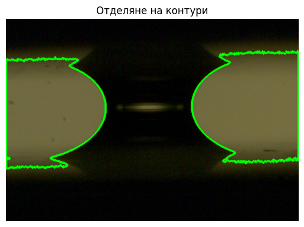

# Determining the Parameters of Capillary Bridges via Machine Vision

## Overview & Goal

Manual measurement of parameters from experimental images of capillary bridges is slow, tedious, and imprecise. This project provides a complete software solution to automate this process using machine vision techniques.

The primary goal is to **automatically measure the key geometric parameters** of capillary bridges from images with a minimal error (aiming for **\~2%** deviation from manual measurements).

The software includes a GUI (built with Tkinter) for real-time video processing from a Basler camera, camera control (exposure, frame rate), and logging measurement data to Excel.

-----

## Technical Algorithm & Workflow

The core of the project is a multi-step image processing pipeline to segment the relevant regions and extract measurements.

### 1\. Preprocessing

All input images are first converted from RGB to grayscale using the standard luminosity method:

$I_\text{gray} = 0.2989 \times R + 0.5870 \times G + 0.1140 \times B$

### 2\. Segmentation

This is the most critical step. The goal is to segment the two reflective regions (objects) from the background. Two main approaches were implemented and compared.

#### Model A: Otsu's Thresholding

A fast, adaptive thresholding method that automatically finds the optimal threshold $T$ by maximizing the inter-class variance $\sigma(T)$ between the object ($o$) and background ($b$) pixels.

* **Pixel Counts:**
$n_o(T) = \sum_{z=T+1}^{L} h(z)$,
$n_b(T) = \sum_{z=0}^{T} h(z)$
* **Pixel Means:**
$m_o = \frac{\sum_{z=T+1}^{L} zh(z)}{n_o(T)}$,
$m_b = \frac{\sum_{z=0}^{T} zh(z)}{n_b(T)}$
* **Variance:**
$\sigma(T) = n_b(T) n_o(T) [ m_b(T) - m_o(T) ]^2$
* **Optimal Threshold:**
$T : \sigma(T) \to \max$

**Contrast Enhancement Filter:** For low-contrast images, an optional filter is applied *before* Otsu's method to improve segmentation. Given a brightness $\beta \in [-255, 255]$ and contrast $\gamma \in [-127, 127]$, the transformation is:

$$f = \frac{131 \cdot (\gamma + 127)}{127 \cdot (131 - \gamma)}$$

$$\alpha_c = f, \quad \gamma_c = 127 \cdot (1 - f)$$

$$\mathbf{I}_o = \alpha_c \cdot \mathbf{I} + \gamma_c$$

#### Model B: Segment Anything (SAM)

A neural network approach was used for more robust segmentation, especially in cases with uneven lighting and complex reflections.

  * **Baseline SAM:** Uses the standard pre-trained `vit_b` SAM model. It is prompted with two bounding boxes, $b_l$ and $b_r$, to isolate the left and right objects.

    $$x_l = I_w - (I_w - 50), \quad x_r = I_w - 50, \quad y = \frac{I_h}{2} + 50$$

    $$b_l = (x_l, y), \quad b_r = (x_r, y)$$

  * **FastSAM:** A faster alternative that replaces the computationally heavy Vision Transformer (ViT) with a CNN (Yoloact architecture).

  * **Fine-Tuned SAM (LoRA):** This is the most accurate model. The baseline SAM was fine-tuned using **Low-Rank Adaptation (LoRA)** on a custom dataset of 115 training and 50 test images. This method "freezes" the original weights $W$ and only trains two small adapter matrices, $B$ and $A$.

    $$W’ = W + B \cdot A$$
  * **Hyperparameters:** 74 epochs, Learning Rate $1 \times 10^{-4}$, LoRA Rank 512.

### 3\. Contour Extraction

After segmentation, the two largest contours, $C_l$ (left) and $C_r$ (right), are extracted from the binary mask using the Suzuki 1985 topological analysis algorithm (via OpenCV).

### 4\. Parameter Measurement

Once the contours $C_l = \{ (x_i, y_i) \}$ and $C_r = \{ (x'_j, y'_j) \}$ are found, the parameters are measured.

**Neck ($n$)**
Calculated by finding the minimum Euclidean distance between any point on $C_l$ and any point on $C_r$.

$$
(i, j) = \arg\min_{i,j} \sqrt{(x_i - x'_j)^2 + (y_i - y'_j)^2}
$$

**Boundaries (Upper, Lower, Left, Right)**
These are defined by the four "most concave" points of the contours.

1.  **Convex Hull:** The convex hulls $H_l$ and $H_r$ are calculated for both contours.

2.  **Convexity Defects:** The deviations ($D_l, D_r$) from the hull are found. The two defects with the largest distance ($max_0, max_1$) for each contour are identified as the endpoints ($U_l, U_r, D_l, D_r$).

1.  **Length Calculation:** The final boundary lengths ($U, D, L, R$) are the Euclidean distances between these four points.

$$U = E(U_l, U_r), \quad D = E(D_l, D_r)
$$
$$$$
$$L = E(U_l, D_l), \quad R = E(U_r, D_r)
$$

**Ellipses**
Ellipses are fitted to the contour points $C_l$ and $C_r$ using the Fitzgibbon algorithm (via OpenCV). The major and minor axes are then extracted from the fitted ellipse parameters.

### 5\. Final Calculations

**Pixel to µm Conversion**
All pixel measurements $p$ are converted to micrometers (µm) using the experimentally determined calibration factor.

$\text{c}(p) = \frac{p \times 3659.269}{1920}$

**Derived Ratios**
Finally, dimensionless ratios used in the theoretical model are calculated (where $n$ is the neck length):

* **Base:** $b = \frac{U + D}{2}$
* **Height:** $h = \frac{L + R}{2}$
* **Ratios:** $x = \frac{b}{n}, \quad y = \frac{h}{n}$

-----

## Results Summary

The models were compared against manual measurements using **Mean Absolute Percentage Error (MAPE)**.

The **Fine-Tuned SAM (LoRA)** model performed best on 3 out of 5 key parameters, achieving the target \~1% error for the critical 'Neck' measurement. Otsu's method remains a viable option for real-time applications where speed is more critical than absolute precision.

| Model | Lower Boundary | Left Boundary | Neck | Right Boundary | Upper Boundary |
| :--- | :---: | :---: | :---: | :---: | :---: |
| Otsu (No Filter) | 3.16 % | 5.44 % | 2.85 % | **9.91 %** | 5.29 % |
| Otsu (w/ Filter) | 4.63 % | 9.45 % | 2.85 % | 18.51 % | **4.75 %** |
| Baseline SAM | 6.76 % | 21.33 % | 1.20 % | 24.24 % | 5.93 % |
| FastSAM | 8.07 % | 15.15 % | 9.65 % | 16.31 % | 7.69 % |
| **Fine-Tuned SAM** | **1.93 %** | **3.35 %** | **1.03 %** | 10.49 % | 9.10 % |

-----

## Limitations

The algorithms (especially Otsu's) struggle with images that have:

1.  **Low contrast/intensity** in the regions where the upper and lower boundaries are.
2.  **Strong reflections** that are located very close to or overlap with the boundaries, as this interferes with the convexity defect detection.

| Problematic Image (Reflections) | Ideal Image (High Contrast) |
| :---: | :---: |
|  |  |

-----

## Future Work

The fine-tuned SAM model is accurate but too slow for real-time use. Otsu's method is fast but less accurate. A promising next step is to apply the **LoRA fine-tuning method to FastSAM/MobileSAM**. This could result in a model that is both fast (suitable for real-time) and highly accurate.